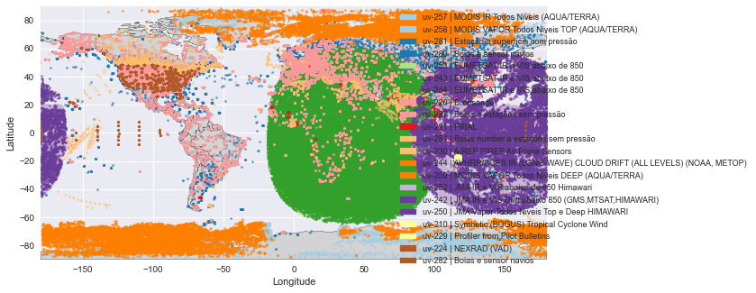
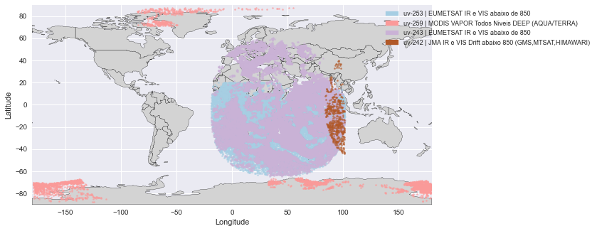
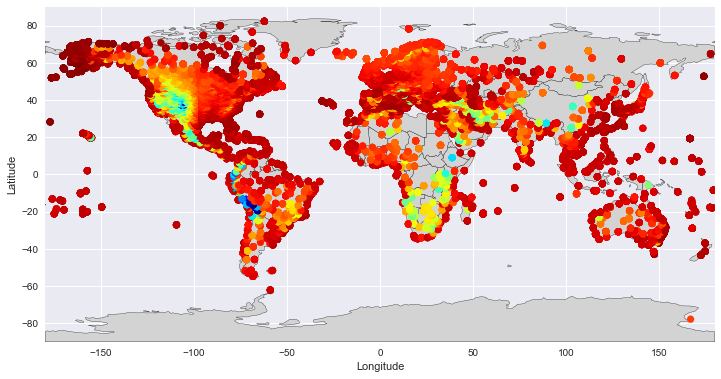

# Uso

Para utilizar o pacote readDiag, primeiro carregue o módulo `gsidiag` do pacote readDiag. Este módulo pode ser carregado como qualquer outro módulo do Python:

```python linenums="1"
import gsidiag as gd
```

Com o módulo carregado, abra o arquivo contendo as informações de diagnósticos do GSI. Neste exemplo, o arquivo [`diag_conv_01.2020031112`](https://github.com/GAD-DIMNT-CPTEC/readDiag/blob/master/data/diag_conv_01.2020031112) (~64 Mb) é um arquivo de diagnóstico do GSI contendo informações de observações convencionais utilizadas na minimização da função custo do método 3DVar, válido para a data 2020031112. Este arquivo é fornecido para testes do pacote e não representa uma situação de diagnóstico operacional do sistema.

Para isso, crie um objeto chamado `file`, a partir do qual serão utilizadas as funções e métodos do readDiag.

!!! note "Nota"

    O comando `%%time` é um comando mágico do Jupyter que contabiliza o tempo que um comando leva para ser executado e não é um requisito para a utilização do readDiag.

Para carregar o arquivo de diagnóstico, faça:

=== "Comando"

    ```python linenums="1"
    %%time

    file = gd.read_diag('./data/diag_conv_01.2020031112')
    ```

=== "Resultado"

    ```python linenums="1"
    CPU times: user 19.4 s, sys: 246 ms, total: 19.7 s
    Wall time: 19.7 s
    ```

## Lista de métodos e funções embutidas

O pacote readDiag possui vários métodos e funções embutidas. Para obter uma lista destes métodos e funções, digite `file.` e pressione a tecla `<TAB>` duas vezes no teclado:

```python linenums="1"
>>> file.
file.close(      file.obsInfo     file.pfileinfo(  file.pvmap(      file.zlevs       
file.kxcount(    file.overview(   file.plot(       file.varNames    
file.obs         file.pcount(     file.ptmap(      file.vcount(
```

Os métodos e funções embutidas possuem documentação de uso, as quais podem ser acessadas por meio das docstrings do Python, com o seguinte comando:

```python linenums="1"
print(object.function_name.__doc__)
```

## Recuperando as informações do arquivo

Agora vamos recuperar as informações básicas contidas dentro do arquivo de diagnóstico convencional fornecido. Estas informações são relacionadas com o arquivo binário em si bem como com as observações e o seu conteúdo. Utilize o método `pfileinfo()` para obter quais observações e tipos (`kx`) estão disponíveis no arquivo:

=== "Comando"

    ```python linenums="1"
    print(file.pfileinfo.__doc__)
    ```

=== "Resultado"

    ```python linenums="1"
    Prints a fancy list of the existing variables and types.

    Usage: pfileinfo()
    ```
Utilizando o método:

=== "Comando"

    ```python linenums="1"
    file.pfileinfo()
    ```

=== "Resultado"

    ```python linenums="1"
    Variable Name : ps
                  └── kx => 181  180  120  187  183  
    
    Variable Name : t
                  └── kx => 181  180  120  187  183  130  126  
    
    Variable Name : q
                  └── kx => 181  120  187  180  183  
    
    Variable Name : uv
                  └── kx => 257  258  281  280  253  243  254  220  287  221  284  230  244  259  252  242  250  210  229  224  282  
    ```

Uma outra forma de recuperar as informações do conteúdo do arquivo, é através da utilização do método `overview()`:

=== "Comando"

    ```python linenums="1"
    print(file.overview.__doc__)
    ```

=== "Resultado"

    ```python linenums="1"
    Creates a dictionary of the existing variables and types. Returns a Python dictionary.

    Usage: overview()
    ```

Utilizando o método:

=== "Comando"

    ```python linenums="1"
    file.overview()
    ```

=== "Resultado"

    ```python linenums="1"
    {'ps': [181, 180, 120, 187, 183],
     't': [181, 180, 120, 187, 183, 130, 126],
     'q': [181, 120, 187, 180, 183],
     'uv': [257,
      258,
      281,
      280,
      253,
      243,
      254,
      220,
      287,
      221,
      284,
      230,
      244,
      259,
      252,
      242,
      250,
      210,
      229,
      224,
      282]}
    ```

Uma forma similar de obter um dicionário contendo a estrutura básica de informações do arquivo, é através da inspeção do atributo `obsInfo`:

=== "Comando"

    ```python linenums="1"
    file.obsInfo
    ```

=== "Resultado"

    ```python linenums="1"
        {'ps':                   lat         lon    elev          prs     hgt   press   time  \
     kx  points                                                                      
     181 0      -72.000000    2.520000  1290.0   824.900024  1290.0   800.0 -180.0   
         1      -70.760002   11.830000   123.0   958.400024   123.0   900.0    0.0   
         2      -72.000000    2.520000  1290.0   824.900024  1290.0   800.0   60.0   
         3      -72.000000    2.520000  1290.0   824.900024  1290.0   800.0    0.0   
         4      -72.000000    2.520000  1290.0   824.900024  1290.0   800.0 -120.0   
     ...               ...         ...     ...          ...     ...     ...    ...   
     183 3732    66.529999  341.980011    17.0   987.400024    17.0   900.0 -180.0   
         3733    65.269997  346.420013    11.0   978.099976    11.0   900.0 -180.0   
         3734    49.430000  357.399994   102.0  1003.400024   102.0  1000.0 -120.0   
         3735    63.779999  341.929993    38.0   972.099976    38.0   900.0    0.0   
         3736    66.529999  341.980011    17.0   988.900024    17.0   900.0    0.0   
     
                 idqc  iuse  iusev     wpbqc       inp_err       adj_err  \
     kx  points                                                            
     181 0        2.0   1.0    0.0  3.893471  1.000000e+00  1.000000e+00   
         1        2.0   1.0    0.0  3.999395  1.000000e+00  1.000000e+00   
         2        2.0   1.0    0.0  3.912592  1.000000e+00  1.000000e+00   
         3        2.0   1.0    0.0  3.874233  1.000000e+00  1.000000e+00   
         4        2.0   1.0    0.0  3.871676  1.000000e+00  1.000000e+00   
     ...          ...   ...    ...       ...           ...           ...   
     183 3732     9.0  -1.0  101.0  3.999699  1.000000e-11  1.000000e-11   
         3733     9.0  -1.0  101.0  3.999699  1.000000e-11  1.000000e-11   
         3734     9.0  -1.0  101.0  3.999699  1.000000e-11  1.000000e-11   
         3735     9.0  -1.0  101.0  3.999699  1.000000e-11  1.000000e-11   
         3736     9.0  -1.0  101.0  3.999699  1.000000e-11  1.000000e-11   
     
                       inverr           oer          obs       omf  \
     kx  points                                                      
     181 0       2.296368e-01  4.354702e+00   824.900024  3.434075   
         1       4.926434e-01  2.029866e+00   958.400024 -1.181676   
         2       2.499149e-01  4.001361e+00   824.900024  3.374524   
         3       2.483187e-01  4.027082e+00   824.900024  3.483506   
         4       2.286168e-01  4.374131e+00   824.900024  3.489466   
     ...                  ...           ...          ...       ...   
     183 3732    1.000000e-11  1.000000e+11   987.400024  0.497376   
         3733    1.000000e-11  1.000000e+11   978.099976 -2.292868   
         3734    1.000000e-11  1.000000e+11  1003.400024  0.943315   
         3735    1.000000e-11  1.000000e+11   972.099976 -2.327267   
         3736    1.000000e-11  1.000000e+11   988.900024  0.669521   
     
                                   geometry  
     kx  points                              
     181 0        POINT (2.52000 -72.00000)  
         1       POINT (11.83000 -70.76000)  
         2        POINT (2.52000 -72.00000)  
         3        POINT (2.52000 -72.00000)  
         4        POINT (2.52000 -72.00000)  
     ...                                ...  
     183 3732    POINT (-18.02002 66.53000)  
         3733    POINT (-13.57996 65.27000)  
         3734     POINT (-2.59998 49.43000)  
         3735    POINT (-18.07001 63.78000)  
         3736    POINT (-18.02002 66.53000)  
     
     [86479 rows x 18 columns],
     't':                   lat        lon    elev         prs     hgt  press   time  \
     kx  points                                                                   
     181 0      -72.000000    2.52000  1290.0  824.900024  1290.0  800.0 -180.0   
         1      -70.760002   11.83000   123.0  958.400024   123.0  900.0    0.0   
         2      -72.000000    2.52000  1290.0  824.900024  1290.0  800.0   60.0   
         3      -72.000000    2.52000  1290.0  824.900024  1290.0  800.0    0.0   
         4      -72.000000    2.52000  1290.0  824.900024  1290.0  800.0 -120.0   
     ...               ...        ...     ...         ...     ...    ...    ...   
     126 2640    39.709999  280.98999   763.0  879.000000  1183.0  800.0   90.0   
         2641    39.709999  280.98999   763.0  872.099976  1247.0  800.0   90.0   
         2642    39.709999  280.98999   763.0  865.299988  1312.0  800.0   90.0   
         2643    39.709999  280.98999   763.0  858.500000  1376.0  800.0   90.0   
         2644    39.709999  280.98999   763.0  851.700012  1441.0  800.0   90.0   
     
                 idqc  iuse  iusev     wpbqc       inp_err       adj_err  \
     kx  points                                                            
     181 0        9.0  -1.0  101.0  3.997126  1.000000e-11  1.000000e-11   
         1        9.0  -1.0  101.0  3.997126  1.000000e-11  1.000000e-11   
         2        9.0  -1.0  101.0  3.997126  1.000000e-11  1.000000e-11   
         3        9.0  -1.0  101.0  3.997126  1.000000e-11  1.000000e-11   
         4        9.0  -1.0  101.0  3.997126  1.000000e-11  1.000000e-11   
     ...          ...   ...    ...       ...           ...           ...   
     126 2640     9.0  -1.0  101.0  3.999373  1.000000e-11  1.000000e-17   
         2641     9.0  -1.0  101.0  3.999373  1.000000e-11  1.000000e-17   
         2642     9.0  -1.0  101.0  3.999373  1.000000e-11  1.000000e-17   
         2643     9.0  -1.0  101.0  3.999373  1.000000e-11  1.000000e-17   
         2644     9.0  -1.0  101.0  3.999373  1.000000e-11  1.000000e-17   
     
                       inverr           oer         obs        omf  \
     kx  points                                                      
     181 0       9.090909e-12  1.100000e+11  257.250000  10.005481   
         1       9.090909e-12  1.100000e+11  263.350006   8.443922   
         2       9.090909e-12  1.100000e+11  257.149994   7.287628   
         3       9.090909e-12  1.100000e+11  257.350006   7.147639   
         4       9.090909e-12  1.100000e+11  257.850006   9.619534   
     ...                  ...           ...         ...        ...   
     126 2640    1.000000e-17  1.000000e+17  278.750000  -0.777656   
         2641    1.000000e-17  1.000000e+17  277.850006  -1.536891   
         2642    1.000000e-17  1.000000e+17  277.950012  -1.106795   
         2643    1.000000e-17  1.000000e+17  277.649994  -1.074093   
         2644    1.000000e-17  1.000000e+17  278.250000  -0.125823   
     
                                   geometry  
     kx  points                              
     181 0        POINT (2.52000 -72.00000)  
         1       POINT (11.83000 -70.76000)  
         2        POINT (2.52000 -72.00000)  
         3        POINT (2.52000 -72.00000)  
         4        POINT (2.52000 -72.00000)  
     ...                                ...  
     126 2640    POINT (-79.01001 39.71000)  
         2641    POINT (-79.01001 39.71000)  
         2642    POINT (-79.01001 39.71000)  
         2643    POINT (-79.01001 39.71000)  
         2644    POINT (-79.01001 39.71000)  
     
     [119806 rows x 18 columns],
     'q':                   lat         lon    elev          prs     hgt   press   time  \
     kx  points                                                                      
     181 0      -72.000000    2.520000  1290.0   824.900024  1290.0   800.0 -180.0   
         1      -70.760002   11.830000   123.0   958.400024   123.0   900.0    0.0   
         2      -72.000000    2.520000  1290.0   824.900024  1290.0   800.0   60.0   
         3      -72.000000    2.520000  1290.0   824.900024  1290.0   800.0    0.0   
         4      -72.000000    2.520000  1290.0   824.900024  1290.0   800.0 -120.0   
     ...               ...         ...     ...          ...     ...     ...    ...   
     183 2879    66.529999  341.980011    17.0   987.400024    17.0   900.0 -180.0   
         2880    65.269997  346.420013    11.0   978.099976    11.0   900.0 -180.0   
         2881    49.430000  357.399994   102.0  1003.400024   102.0  1000.0 -120.0   
         2882    63.779999  341.929993    38.0   972.099976    38.0   900.0    0.0   
         2883    66.529999  341.980011    17.0   988.900024    17.0   900.0    0.0   
     
                 idqc  iuse  iusev     wpbqc   inp_err   adj_err    inverr  \
     kx  points                                                              
     181 0        9.0  -1.0  101.0  3.999686  0.000168  0.000168  0.000168   
         1        9.0  -1.0  101.0  3.999686  0.000101  0.000101  0.000101   
         2        9.0  -1.0  101.0  3.999686  0.000134  0.000134  0.000134   
         3        9.0  -1.0  101.0  3.999686  0.000130  0.000130  0.000130   
         4        9.0  -1.0  101.0  3.999686  0.000153  0.000153  0.000153   
     ...          ...   ...    ...       ...       ...       ...       ...   
     183 2879     9.0  -1.0  102.0  3.999624  0.000027  0.000027  0.000027   
         2880     9.0  -1.0  102.0  3.999624  0.000024  0.000024  0.000024   
         2881     9.0  -1.0  102.0  3.999624  0.000012  0.000012  0.000012   
         2882     9.0  -1.0  102.0  3.999624  0.000025  0.000025  0.000025   
         2883     9.0  -1.0  102.0  3.999624  0.000027  0.000027  0.000027   
     
                          oer    obs       omf                    geometry  
     kx  points                                                             
     181 0       5.943092e+09  0.642  0.401663   POINT (2.52000 -72.00000)  
         1       9.868145e+09  0.704  0.184449  POINT (11.83000 -70.76000)  
         2       7.483589e+09  0.660  0.312951   POINT (2.52000 -72.00000)  
         3       7.715163e+09  0.608  0.291117   POINT (2.52000 -72.00000)  
         4       6.533783e+09  0.620  0.354148   POINT (2.52000 -72.00000)  
     ...                  ...    ...       ...                         ...  
     183 2879    3.765171e+10  3.137  0.039949  POINT (-18.02002 66.53000)  
         2880    4.089849e+10  4.404  0.688853  POINT (-13.57996 65.27000)  
         2881    8.171652e+10  7.961  0.332091   POINT (-2.59998 49.43000)  
         2882    4.010423e+10  2.804 -0.628379  POINT (-18.07001 63.78000)  
         2883    3.650832e+10  3.017  0.002453  POINT (-18.02002 66.53000)  
     
     [106269 rows x 18 columns],
     'uv':                   lat         lon     elev          prs   hgt   press   time  \
     kx  points                                                                     
     257 0      -86.449997    4.660000  61056.0   350.000000  41.0   300.0  -98.0   
         1       68.099998   16.809999  81080.0   550.000000  52.0   500.0  -48.0   
         2       68.099998   14.390000  69073.0   475.000000  32.0   400.0  -48.0   
         3       67.709999   17.830000  68073.0   587.000000  36.0   500.0  -48.0   
         4       67.980003   13.280000  61068.0   487.000000  25.0   400.0  -48.0   
     ...               ...         ...      ...          ...   ...     ...    ...   
     282 199      1.900000  264.500000      0.0  1009.716980  20.0  1000.0   60.0   
         200      1.900000  264.500000      0.0  1009.551941  20.0  1000.0  -60.0   
         201      1.900000  264.500000      0.0  1009.789490  20.0  1000.0  120.0   
         202      1.900000  264.500000      0.0  1009.366821  20.0  1000.0 -180.0   
         203      1.900000  264.500000      0.0  1009.644531  20.0  1000.0    0.0   
     
                 idqc  iuse  iusev     wpbqc   inp_err   adj_err        inverr  \
     kx  points                                                                  
     257 0        2.0   1.0    0.0  3.987122  0.158730  0.158730  1.587301e-01   
         1        2.0   1.0    0.0  3.972124  0.250000  0.250000  2.500000e-01   
         2        2.0   1.0    0.0  3.974319  0.219780  0.219780  2.197802e-01   
         3        2.0  -1.0    0.0  1.000000  0.250000  0.250000  2.938736e-39   
         4        2.0   1.0    0.0  3.966050  0.230734  0.230734  2.307337e-01   
     ...          ...   ...    ...       ...       ...       ...           ...   
     282 199      2.0   1.0    0.0  3.973792  0.454545  0.454545  1.967942e-01   
         200      2.0   1.0    0.0  3.992598  0.454545  0.454545  1.942808e-01   
         201      2.0   1.0    0.0  3.990781  0.454545  0.454545  2.010269e-01   
         202      2.0   1.0    0.0  3.985443  0.454545  0.454545  2.010269e-01   
         203      2.0   1.0    0.0  3.962385  0.454545  0.454545  1.942808e-01   
     
                          oer        obs       omf                   geometry  
     kx  points                                                                
     257 0       6.300000e+00  -2.569993 -0.547760  POINT (4.66000 -86.45000)  
         1       4.000000e+00   8.553662  4.964206  POINT (16.81000 68.10000)  
         2       4.550000e+00  11.719213  4.831792  POINT (14.39000 68.10000)  
         3      -1.000000e+15  11.682516  8.523585  POINT (17.83000 67.71000)  
         4       4.334000e+00  12.741393  6.365394  POINT (13.28000 67.98000)  
     ...                  ...        ...       ...                        ...  
     282 199     5.081450e+00   2.000000  2.684659  POINT (-95.50000 1.90000)  
         200     5.147189e+00   1.000000  1.796477  POINT (-95.50000 1.90000)  
         201     4.974460e+00   1.000000  1.545947  POINT (-95.50000 1.90000)  
         202     4.974460e+00   1.400000  2.060712  POINT (-95.50000 1.90000)  
         203     5.147189e+00   2.000000  2.838662  POINT (-95.50000 1.90000)  
     
     [402891 rows x 18 columns]}
    ```

Note que o comando anterior retornou um dicionário com todas as informações de todas as observações e tipos disponíveis no arquivo. Para filtrar esses informações por observações, utilize os seguintes comandos:

=== "Comando"

    ```python linenums="1"
    file.obsInfo.keys()
    ```

=== "Resultado"

    ```python linenums="1"
    dict_keys(['ps', 't', 'q', 'uv'])
    ```

Para a observação `ps`:

=== "Comando"

    ```python linenums="1"
    file.obsInfo['ps']
    ```

=== "Resultado"

    |   |      |lat         |lon      |elev  |prs       |hgt   |press  |time    |idqc|iuse|iusev|wpbqc   |inp_err     |adj_err     |inverr      |oer         |obs       |omf      |geometry                   |
    |---|------|------------|---------|------|----------|------|-------|--------|----|----|-----|--------|------------|------------|------------|------------|----------|---------|---------------------------|
    |kx |points|            |         |      |          |      |       |        |    |    |     |        |            |            |            |            |          |         |                           |
    |181|     0|	-72.000000|2.520000	|1290.0|824.900024|1290.0|	800.0|	-180.0| 2.0| 1.0|	0.0	|3.893471|1.000000e+00|1.000000e+00|2.296368e-01|4.354702e+00|824.900024|3.434075	| POINT (2.52000 -72.00000) |
    |   |     1|	-70.760002|11.830000|	123.0|958.400024| 123.0|  900.0|     0.0| 2.0| 1.0|	0.0	|3.999395|1.000000e+00|1.000000e+00|4.926434e-01|2.029866e+00|958.400024|-1.181676| POINT (11.83000 -70.76000)|
    |   |     2|	-72.000000|2.520000	|1290.0|824.900024|1290.0|	800.0|	  60.0| 2.0| 1.0|	0.0	|3.912592|1.000000e+00|1.000000e+00|2.499149e-01|4.001361e+00|824.900024|3.374524	| POINT (2.52000 -72.00000) |
    |   |     3|	-72.000000|2.520000	|1290.0|824.900024|1290.0|	800.0|	   0.0| 2.0| 1.0|	0.0	|3.874233|1.000000e+00|1.000000e+00|2.483187e-01|4.027082e+00|824.900024|3.483506	| POINT (2.52000 -72.00000) |
    |   |     4|	-72.000000|2.520000	|1290.0|824.900024|1290.0|	800.0|	-120.0| 2.0| 1.0|	0.0	|3.871676|1.000000e+00|1.000000e+00|2.286168e-01|4.374131e+00|824.900024|3.489466	| POINT (2.52000 -72.00000) |
    |...|	  ...|	       ...|     ...	|   ...|       ...|   ...|	  ...|	   ...| ...| ...|	...	|     ...|	       ...|         ...|	       ...|        	...|	     ...|     ... |	...                       |
    
    86479 rows x 18 columns

Note que o resultado do comando `file.obsInfo['ps']` foi um dataframe do Pandas (de fato, um dataframe multiindex) com todas as informações relacionadas à observação `ps` (pressão em superfície). Mais informações sobre como trabalhar com o dataframe e filtrar algumas informações são apresentadas nas próximas seções.

Utilize o atributo `varNames` para obter uma lista com os nomes das variáveis dentro do arquivo:

=== "Comando"

    ```python linenums="1"
    file.varNames
    ```

=== "Resultado"

    ```python linenums="1"
    ['ps', 't', 'q', 'uv']
    ```

Uma outra forma de obter uma lista de variáveis é através da utilização dos métodos do Pandas:

=== "Comando"

    ```python linenums="1"
    file.obs.groupby(level=0).size().sort_values(ascending=False).keys()
    ```

=== "Resultado"

    ```python linenums="1"
    Index(['uv', 't', 'q', 'ps'], dtype='object')
    ```

Para se obter uma lista dos níveis verticais padrão, utilize o atributo `zlevs`:

=== "Comando"

    ```python linenums="1"
    file.zlevs
    ```

=== "Resultado"

    ```python linenums="1"
    [1000.0,
     900.0,
     800.0,
     700.0,
     600.0,
     500.0,
     400.0,
     300.0,
     250.0,
     200.0,
     150.0,
     100.0,
     50.0,
     0.0]
    ```

## Explorando os dados

Na seção anterior, foi apresentado uma visão geral sobre as funções e métodos embutidos do pacote readDiag. Neste seção, será dada uma visão geral sobre como trabalhar com o dataframe do Pandas para recuperar e filtrar algumas informações relacionadas com as observações do arquivo de diagnóstico fornecido.

Para contar o número de records de um tipo de observação, utilize o método `pcount()`. Este método retorna um histograma com a contagem dos tipo (i.e., `kx`) de uma dada observação:

=== "Comando"

    ```python linenums="1"
    print(file.pcount.__doc__)
    ```

=== "Resultado"

    ```python linenums="1"
    Plots a histogram of the desired variable and types.

    Usage: pcount(VarName)
    ```
Utilizando o método para a pressão em superfície (`ps`):

=== "Comando"

    ```python linenums="1"
    file.pcount('ps')
    ```

=== "Resultado"

    

Utilizando a função para a temperatura (`t`):

=== "Comando"

    ```python linenums="1"
    file.pcount('t')
    ```

=== "Resultado"

    

Utilizando a função para a humidade (`q`):

=== "Comando"

    ```python linenums="1"
    file.pcount('q')
    ```

=== "Resultado"

    

Utilizando a função para o vento (`w`):

=== "Comando"

    ```python linenums="1"
    file.pcount('uv')
    ```

=== "Resultado"

    

### Explorando o dataframe

O dataframe do Pandas é uma estrutura de dados tabular com funções e métodos próprios. Nesta seção, são apresentadas algumas operações genéricas relacionadas com ele.

Anteriormente, o método `obsInfo` foi utilizado para recuperar um dicionário com um dataframe para cada observação, e.g., para a observação temperatura (`t`):

=== "Comando"

    ```python linenums="1"
    file.obsInfo['t']
    ```

=== "Resultado"

    |   |      |lat         |lon      |elev  |prs       |hgt   |press  |time    |idqc|iuse|iusev|wpbqc   |inp_err     |adj_err     |inverr      |oer         |obs       |omf      |geometry                   |
    |---|------|------------|---------|------|----------|------|-------|--------|----|----|-----|--------|------------|------------|------------|------------|----------|---------|---------------------------|
    |kx |points|            |         |      |          |      |       |        |    |    |     |        |            |            |            |            |          |         |                           |
    |181|    0 |-72.000000	|2.52000	|1290.0|824.900024|1290.0|800.0  |-180.0	|9.0 |-1.0|101.0|3.997126|1.000000e-11|1.000000e-11|9.090909e-12|1.100000e+11|257.250000|10.005481|	POINT (2.52000 -72.00000) |
    |   |    1 |-70.760002	|11.83000	|123.0 |958.400024|123.0 |900.0  |0.0	    |9.0 |-1.0|101.0|3.997126|1.000000e-11|1.000000e-11|9.090909e-12|1.100000e+11|263.350006|8.443922 |	POINT (11.83000 -70.76000)|
    |   |    2 |-72.000000	|2.52000	|1290.0|824.900024|1290.0|800.0  |60.0	  |9.0 |-1.0|101.0|3.997126|1.000000e-11|1.000000e-11|9.090909e-12|1.100000e+11|257.149994|7.287628	| POINT (2.52000 -72.00000) |
    |   |    3 |-72.000000	|2.52000	|1290.0|824.900024|1290.0|800.0  |0.0	    |9.0 |-1.0|101.0|3.997126|1.000000e-11|1.000000e-11|9.090909e-12|1.100000e+11|257.350006|7.147639	| POINT (2.52000 -72.00000) |
    |   |    4 |-72.000000	|2.52000	|1290.0|824.900024|1290.0|800.0  |-120.0	|9.0 |-1.0|101.0|3.997126|1.000000e-11|1.000000e-11|9.090909e-12|1.100000e+11|257.850006|9.619534	| POINT (2.52000 -72.00000) |
    |...|	  ...|	       ...|     ...	|   ...|       ...|   ...|	  ...|	   ...| ...| ...|	...	|     ...|	       ...|         ...|	       ...|        	...|	     ...|     ... |	...                       |
    
    119806 rows x 18 columns

Este dataframe é do tipo multiindex, i.e., uma estrutura de dados tabular com índices múltiplos. Os índices podem ser recuperados com o comando:

=== "Comando"

    ```python linenums="1"
    file.obsInfo['t'].index.names
    ```

=== "Resultado"

    ```python linenums="1"
    FrozenList(['kx', 'points'])
    ```

Os `kx` e `points` são índices para os quais todas as colunas do dataframe são definidas. Isto significa que, para uma data observação, há um número de `kx` (tipo de observação) e `points` (o índice de cada ponto de observação daquele tipo de observação).

!!! note "Nota"

    Embora o índice `points` indexe cada tipo de observação, a sua coordenada real lat/lon é dada pela coluna `geometry` (a qual é formada pelas colunas `lat` e `lon`).

Para simplificar o uso de alguns comando, criaremos a variável `df_t` que conterá a estrutura do dataframe da observação de temperatura:

```python linenums="1"
df_t = file.obsInfo['t']
```

A observação de temperatura possui os seguintes tipos:

=== "Comando"

    ```python linenums="1"
    df_t.index.get_level_values('kx').unique()
    ```

=== "Resultado"

    ```python linenums="1"
    Int64Index([181, 180, 120, 187, 183, 130, 126], dtype='int64', name='kx')
    ```

Se você quiser filtrar todos os tipos de temperatura do tipo 120, utilize o comando:

=== "Comando"

    ```python linenums="1"
    df_t.iloc[df_t.index.get_level_values('kx') == 120]
    ```

=== "Resultado"

    |   |      |lat         |lon      |elev  |prs       |hgt          |press  |time      |idqc|iuse|iusev|wpbqc   |inp_err     |adj_err     |inverr      |oer         |obs       |omf      |geometry                   |
    |---|------|------------|---------|------|----------|-------------|-------|----------|----|----|-----|--------|------------|------------|------------|------------|----------|---------|---------------------------|
    |kx |points|            |         |      |          |             |       |          |    |    |     |        |            |            |            |            |          |         |                           |
    |120|	 0	 |-30.670000	|24.000000|1287.0|871.0	    |1.287000e+03	|800.0	|-45.000000|2.0	|1.0 |0.0	 |3.999999|1.250000	   |0.980566	  |0.266639	   |3.750382	  |300.649994|-0.785228|POINT (24.00000 -30.67000) |
    |   |  1	 |-30.670271	|23.999821|1287.0|867.0	    |1.000000e+11	|800.0	|-44.865601|2.0	|1.0 |0.0	 |3.850856|1.250000	   |0.849141	  |0.849141	   |1.177661	  |297.450012|-3.986862|POINT (23.99982 -30.67027) |
    |   |  2	 |-30.671200	|23.999109|1287.0|855.0	    |1.000000e+11	|800.0	|-44.461800|2.0	|1.0 |0.0	 |3.989482|1.250000	   |0.880636	  |0.880636	   |1.135542	  |296.450012|-3.529222|POINT (23.99911 -30.67120) |
    |   |  3	 |-30.671721	|23.998690|1287.0|850.0	    |1.508000e+03	|800.0	|-44.263199|2.0	|1.0 |0.0	 |3.991446|1.250000	   |1.004662	  |1.004662	   |0.995360	  |295.950012|-3.491445|POINT (23.99869 -30.67172) |
    |   |  4	 |-30.675381	|23.996031|1287.0|819.0	    |1.000000e+11	|800.0	|-43.195198|2.0	|1.0 |0.0	 |3.996317|1.250000	   |1.250000	  |1.250000	   |0.800000	  |292.850006|-3.333173|POINT (23.99603 -30.67538) |
    |   |	  ...|	       ...|     ...	|   ...|       ...|          ...|	   ...|	      ...| ...| ...|...  |     ...|	        ...|         ...|	        ...|         ...|       ...|     ... |	...                      |


Da mesma forma, criaremos uma outra variável `df_t120` que conterá as informações da observação temperatura do tipo 120:

```python linenums="1"
df_t120 = df_t.iloc[df_t.index.get_level_values('kx') == 120]
```

Para imprimir o shape do dataframe, utilize:

=== "Comando"

    ```python linenums="1"
    df_t120.shape
    ```

=== "Resultado"

    ```python linenums="1"
    (30756, 18)
    ```
Da mesma forma, para imprimir os nomes das colunas:

=== "Comando"

    ```python linenums="1"
    df_t120.columns
    ```

=== "Resultado"

    ```python linenums="1"
    Index(['lat', 'lon', 'elev', 'prs', 'hgt', 'press', 'time', 'idqc', 'iuse',
           'iusev', 'wpbqc', 'inp_err', 'adj_err', 'inverr', 'oer', 'obs', 'omf',
           'geometry'],
          dtype='object')    
    ```

Para imprimir o cabeçalho do dataframe (i.e., as primeiras linhas):

=== "Comando"

    ```python linenums="1"
    df_t120.head()
    ```

=== "Resultado"

    |   |      |lat         |lon      |elev  |prs       |hgt          |press  |time      |idqc|iuse|iusev|wpbqc   |inp_err     |adj_err     |inverr      |oer         |obs       |omf      |geometry                   |
    |---|------|------------|---------|------|----------|-------------|-------|----------|----|----|-----|--------|------------|------------|------------|------------|----------|---------|---------------------------|
    |kx |points|            |         |      |          |             |       |          |    |    |     |        |            |            |            |            |          |         |                           |
    |120|	 0	 |-30.670000	|24.000000|1287.0|871.0	    |1.287000e+03	|800.0	|-45.000000|2.0	|1.0 |0.0	 |3.999999|1.250000	   |0.980566	  |0.266639	   |3.750382	  |300.649994|-0.785228|POINT (24.00000 -30.67000) |
    |   |  1	 |-30.670271	|23.999821|1287.0|867.0	    |1.000000e+11	|800.0	|-44.865601|2.0	|1.0 |0.0	 |3.850856|1.250000	   |0.849141	  |0.849141	   |1.177661	  |297.450012|-3.986862|POINT (23.99982 -30.67027) |
    |   |  2	 |-30.671200	|23.999109|1287.0|855.0	    |1.000000e+11	|800.0	|-44.461800|2.0	|1.0 |0.0	 |3.989482|1.250000	   |0.880636	  |0.880636	   |1.135542	  |296.450012|-3.529222|POINT (23.99911 -30.67120) |
    |   |  3	 |-30.671721	|23.998690|1287.0|850.0	    |1.508000e+03	|800.0	|-44.263199|2.0	|1.0 |0.0	 |3.991446|1.250000	   |1.004662	  |1.004662	   |0.995360	  |295.950012|-3.491445|POINT (23.99869 -30.67172) |
    |   |  4	 |-30.675381	|23.996031|1287.0|819.0	    |1.000000e+11	|800.0	|-43.195198|2.0	|1.0 |0.0	 |3.996317|1.250000	   |1.250000	  |1.250000	   |0.800000	  |292.850006|-3.333173|POINT (23.99603 -30.67538) |

Pode-se também contar o número de observações marcadas com `iuse=1` e `iuse=-1` (i.e., observações marcadas como usadas e monitoradas, respectivamente). Para isso, primeiro filtre os valores únicos do marcador `iuse` com o seguinte comando:

=== "Comando"

    ```python linenums="1"
    df_t120['iuse'].unique()
    ```

=== "Resultado"

    ```python linenums="1"
    array([ 1., -1.], dtype=float32)
    ```

A seguir, `dt_120_iuse` é uma variável que contém apenas a coluna `iuse` do dataframe `df_t120`:

```python linenums="1"
df_t120_iuse = df_t120['iuse']
```

Para contar o número de observações de temperatura do tipo 120, marcadas com `iuse=1` ou `iuse=-1`, utilize o método `count()` do Pandas:

=== "Comando"

    ```python linenums="1"
    df_t120_iuse.loc[df_t120['iuse'] == 1].count()
    ```

=== "Resultado"

    ```python linenums="1"
    30572
    ```

E para o marcado `iuse=-1`:

=== "Comando"

    ```python linenums="1"
    df_t120_iuse.loc[df_t120['iuse'] == -1].count()
    ```

=== "Resultado"

    ```python linenums="1"
    184
    ```

Observe que `30572 + 184 = 30756` representa do número total de linhas do dataframe `df_t120`, que contabiliza o número total de observações.

Se você quiser plotar uma série temporal de OMF (Observação Menos Previsão), que contabiliza a inovação trazida pelas observações para as previsões durante o processo de assimilação, é possível filtrar a coluna `omf` e recuperar apenas as observações marcadas com `iuse=1` (neste caso, para as observações de temperatura do tipo 120):

=== "Comando"

    ```python linenums="1"
    df_t120['omf'].loc[df_t120_iuse == 1]
    ```

=== "Resultado"

    ```python linenums="1"
    kx   points
    120  0        -0.785228
         1        -3.986862
         2        -3.529222
         3        -3.491445
         4        -3.333173
                     ...   
         30751     1.432701
         30752     2.843098
         30753     7.515910
         30754     0.165799
         30755     1.736573
    Name: omf, Length: 30572, dtype: float32
    ```

Para plotar uma figura com a série dos valores de `omf` por índices das observações de temperatura do tipo 120, utilize o método `plot()` do dataframe do Pandas:

=== "Comando"

    ```python linenums="1"
    df_t120['omf'].loc[df_t120_iuse == 1].plot()
    ```

=== "Resultado"

    

Pela figura, embora seja possível identificar alguns índices para os quais os valores de `omf` são maiores (e.g., maiores do que +/- 10), não é possível identificar em quais níveis estas observações estão. Na próxima seção, algumas funções de plotagem embutidas do readDiag serão introduzidas para facilitar esse tipo de análise.

Uma forma alternativa de se selecionar as colunas de um dataframe do Pandas é a seguir:

=== "Comando"

    ```python linenums="1"
    df_t120.loc[:,'omf']
    ```

=== "Resultado"

    ```python linenums="1"
    kx   points
    120  0        -0.785228
         1        -3.986862
         2        -3.529222
         3        -3.491445
         4        -3.333173
                     ...   
         30751     1.432701
         30752     2.843098
         30753     7.515910
         30754     0.165799
         30755     1.736573
    Name: omf, Length: 30756, dtype: float32
    ```

## Fazendo plotagens espaciais utilizando as funções embutidas do readDiag

Até aqui, todos os métodos e funções do pacote readDiag foram utilizadas para explorar algumas informações do arquivos de diagnóstico de observações convencionais do GSI através de estruturas e dados adequadas. O pacote readDiag possui algumas funções embutidas que viabilizam a sua capacidade para explorar os dados através de figuras espaciais.

Estas funções são as seguintes:

* `ptmap()`: esta função plota uma determinada observação de um determinado tipo;
* `pvmap()`: esta função plota observações selecionadas sem especificar o seu tipo, utilizando o marcador `iuse`;
* `plot()`: esta função plota uma figura espacial para uma determinada observação utilizando a informação das colunas disponíveis no dataframe.

Utilize a função embutida `ptmap()` para plotar uma figura com a distribuição espacial de alguma observação dada pelo seu tipo (`kx`). Lembre-se de utiliza a docstring da função para obter uma visão geral sobre o seu uso:


=== "Comando"

    ```python linenums="1"
    print(file.ptmap.__doc__)
    ```

=== "Resultado"

    ```python linenums="1"
    The ptmap function plots the selected observation for the selected kinds.

    Example:
    a.ptmap('uv', [290, 224, 223])
        
    In the above example, a plot for the wind (uv) for the kinds 290 (ASCATW), 224 (VADWND) and 223 (PROFLR) will be made.

    Note: If no kind is explicity informed, all kinds for that particular observation will be considered, which may clutter the plot.   
    ```

Utilizando a função `ptmap` com a variável `uv`:

=== "Comando"

    ```python linenums="1"
    %%time
    
    file.ptmap('uv')
    ```

=== "Resultado"

    ```
    CPU times: user 17.7 s, sys: 248 ms, total: 17.9 s
    Wall time: 17.5 s
    ```

    

Como a função `ptmap()` utiliza a informação sobre a observação e o seu tipo, é possível também passar uma lista de `kx` relacionada com o tipo de observação (isso também ajuda a limpar a distribuição espacial e leva menos tempo para se obter a figura). Lembre-se de que é possível utilizar a função embutida `pfileinfo()` para se obter os `kx` de cada observação contida no arquivo:

=== "Comando"

    ```python linenums="1"
    %%time
    
    file.ptmap('uv', [253, 259, 243, 242])
    ```

=== "Resultado"

    ```
    CPU times: user 3.28 s, sys: 252 ms, total: 3.54 s
    Wall time: 3.1 s
    ```
    
    

Outra função embutida interessante é a função `pvmap()`, que plota a distribuição espacial de diferentes observações considerando todos os tipos disponíveis. Neste caso, é necessário especificar o marcado `iuse` da observação a ser plotada, i.e., `iuse=1` para usada e `iuse=-1` para monitorada. Os status das observações devem ser passados como uma lista de pelo menos um elemento:

=== "Comando"

    ```python linenums="1"
    print(file.pvmap.__doc__)
    ```

=== "Resultado"

    ```python linenums="1"
    The pvmap function plots the selected observations without specifying its kinds. It used the flag iuse instead. 

    Example:
    a.pvmap(['uv','ps','t','q'], mask='iuse==1')
        
    In the above example, a plot for the used (iuse=1) observations of wind (uv), surface pressure (ps), temperature (t) and moisture (q) will be made.        
    ```

Utilizando a função `pvmap` com uma lista de variáveis filtradas pelo marcador `iuse=1`:

=== "Comando"

    ```python linenums="1"
    %%time
    
    file.pvmap(['uv','ps','t','q'], mask='iuse==1')
    ```

=== "Resultado"

    ```
    CPU times: user 11.1 s, sys: 235 ms, total: 11.3 s
    Wall time: 10.8 s
    ```
    
    

A função embutida `plot` plota uma distribuição espacial das variáveis utilizando uma das colunas do dataframe. No exemplo abaixo, é feita uma figura com os valores (quando a coluna `obs` é utilizada) das observações de pressão em superfície do tipo 187 usada no processo de assimilação:

=== "Comando"

    ```python linenums="1"
    print(file.plot.__doc__)
    ```

=== "Resultado"

    ```python linenums="1"
    The plot function makes a plot for the selected observation by using information of the following columns available within the dataframe.
 
    Available columns to be used with the plot function:

    lat  : All latitudes from the selected kinds 
    lon  : All longitudes from the selected kinds
    prs  : Pressure level of the observation
    lev  : Pressure levels of the observation 
    time : Time of the observation (in minutes, relative to the analysis time)
    idqc : Quality control mark or event mark 
    iuse : Use flag (use = 1; monitoring = -1)
    iusev: Value of the flag used in the analysis
    obs  : Observation value

    Example:
    gd.plot('ps', 187, 'obs', mask='iuse == 1')
        
    In the above example, a plot will be made displaying by using the values of the used surface pressure observations of the kind 187 (ADPSFC).
    ```

Utilizando a função `plot` com a observação `ps` do tipo 187 filtrada pelo marcador `iuse=1`:

=== "Comando"

    ```python linenums="1"
    %%time 
    
    file.plot('ps', 187, 'obs', mask='iuse==1')
    ```

=== "Resultado"

    ```
    CPU times: user 2.6 s, sys: 140 ms, total: 2.74 s
    Wall time: 2.44 s
    ```
    
    

Finalmente, para liberar a memória utilizada para armazenar o arquivo binário, utilize o método `close()`, o qual deverá retornar o valor `0` quando o arquivo for fechado corretamente:

=== "Comando"

    ```python linenums="1"
    file.close()
    ```

=== "Resultado"

    ```python linenums="1"
    0
    ```
